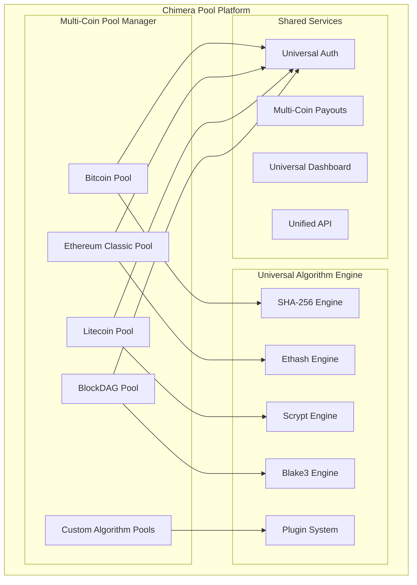

# Chimera Pool - Universal Mining Pool Platform

## Overview

Chimera Pool is a next-generation, universal mining pool platform that supports multiple cryptocurrencies through its revolutionary hot-swappable algorithm engine. Built for scalability, security, and ease of use, Chimera Pool enables operators to run mining pools for any proof-of-work cryptocurrency with zero-downtime algorithm updates and enterprise-grade performance.

## Strategic Vision

### Why Universal Mining Pool Platform?

1. **Market Expansion**: Serve miners of ALL cryptocurrencies, not just one
2. **Revenue Diversification**: Multiple income streams from different coins
3. **Competitive Advantage**: One platform for many pools vs. competitors' single-coin focus
4. **Future-Proofing**: Easy to add new cryptocurrencies as they emerge
5. **Community Building**: Larger, more diverse mining community

### Supported Cryptocurrencies

- **Bitcoin** (SHA-256)
- **Ethereum Classic** (Ethash)
- **BlockDAG** (Blake3)
- **Litecoin** (Scrypt)
- **Dash** (X11)
- **Monero** (RandomX)
- **Zcash** (Equihash)
- **And many more...**

## Core Principles

1. **Algorithm Agnosticism**: Hot-swappable mining algorithms without downtime
2. **Zero-Configuration Experience**: One-click deployment and automatic optimization
3. **Comprehensive Testing**: Built-in simulation and testing environment
4. **Universal Compatibility**: Support for any proof-of-work cryptocurrency

## Architecture

### High-Level Architecture



### Technology Stack

**Primary Language**: Go
- Excellent concurrency support for high-throughput mining operations
- Cross-platform compilation for universal deployment
- Strong ecosystem for blockchain and networking applications
- Low learning curve for community contributions

**Algorithm Engine**: Rust
- Maximum performance for cryptographic operations
- Memory safety for security-critical components
- Hot-swappable shared libraries (.so/.dll/.dylib)
- WebAssembly support for browser-based testing

**Frontend**: React + TypeScript with Cyber-Minimal Theme
- Modern, responsive web dashboard with cyber-minimal aesthetic
- Real-time updates via WebSocket with animated data visualizations
- Mobile-first design optimized for the cyber-minimal theme
- Component-based architecture with consistent design system
- Dark theme with neon accents and minimalist typography
- Animated UI elements with subtle cyber-inspired transitions

**Database Stack**:
- **PostgreSQL**: Primary data store for accounts, transactions, and statistics
- **Redis**: High-performance caching and session management
- **InfluxDB**: Time-series data for mining statistics and monitoring

**Infrastructure**:
- **Docker**: Containerized deployment with orchestration support
- **NGINX**: Load balancing and SSL termination
- **Prometheus + Grafana**: Metrics collection and visualization
- **Let's Encrypt**: Automatic SSL certificate management

## Algorithm Support Matrix

```yaml
Supported Algorithms:
  SHA-256:
    cryptocurrencies: [Bitcoin, Bitcoin Cash, Bitcoin SV]
    asic_optimized: true
    gpu_mining: false
    cpu_mining: false
    
  Ethash:
    cryptocurrencies: [Ethereum Classic, EthereumPoW]
    asic_optimized: false
    gpu_mining: true
    cpu_mining: false
    
  Scrypt:
    cryptocurrencies: [Litecoin, Dogecoin]
    asic_optimized: true
    gpu_mining: true
    cpu_mining: true
    
  Blake3:
    cryptocurrencies: [BlockDAG]
    asic_optimized: true
    gpu_mining: true
    cpu_mining: true
    
  X11:
    cryptocurrencies: [Dash]
    asic_optimized: true
    gpu_mining: true
    cpu_mining: true
    
  RandomX:
    cryptocurrencies: [Monero]
    asic_optimized: false
    gpu_mining: true
    cpu_mining: true
    
  Equihash:
    cryptocurrencies: [Zcash, Bitcoin Gold]
    asic_optimized: true
    gpu_mining: true
    cpu_mining: false
```

## Core Components

### 1. Hot-Swappable Algorithm Engine (Rust)

The Algorithm Engine is the heart of the universal mining system, designed as a sophisticated plugin architecture that allows runtime algorithm changes without service interruption.

#### Algorithm Package Standard

**Package Structure**:
```
algorithm-package-sha256-v1.0.0.zip
├── manifest.json          # Package metadata and configuration
├── algorithm.wasm         # WebAssembly binary for cross-platform compatibility
├── algorithm.so           # Linux shared library (optional, for performance)
├── algorithm.dll          # Windows shared library (optional)
├── algorithm.dylib        # macOS shared library (optional)
├── tests/                 # Test vectors and validation data
│   ├── test_vectors.json
│   └── benchmark_data.json
├── docs/                  # Algorithm documentation
│   ├── README.md
│   └── CHANGELOG.md
└── signature.sig          # Cryptographic signature
```

#### Core Algorithm Interface

```rust
pub trait MiningAlgorithm: Send + Sync {
    // Core hashing functions
    fn name(&self) -> &str;
    fn version(&self) -> &str;
    fn hash(&self, input: &[u8]) -> AlgorithmResult<Vec<u8>>;
    fn verify(&self, input: &[u8], target: &[u8], nonce: u64) -> AlgorithmResult<bool>;
    
    // Difficulty management
    fn difficulty_adjustment(&self, current: u64, target_time: u64, actual_time: u64) -> AlgorithmResult<u64>;
    fn calculate_target(&self, difficulty: u64) -> AlgorithmResult<Vec<u8>>;
    
    // Performance and compatibility
    fn benchmark(&self) -> AlgorithmResult<BenchmarkResults>;
    fn validate_compatibility(&self) -> AlgorithmResult<CompatibilityReport>;
    fn get_memory_requirements(&self) -> AlgorithmResult<MemoryRequirements>;
    
    // Migration support
    fn supports_migration_from(&self, algorithm: &str) -> bool;
    fn prepare_migration(&self, from_algorithm: &str) -> AlgorithmResult<MigrationPlan>;
    fn finalize_migration(&self) -> AlgorithmResult<()>;
    
    // Health and monitoring
    fn health_check(&self) -> AlgorithmResult<HealthStatus>;
    fn get_metrics(&self) -> AlgorithmResult<AlgorithmMetrics>;
}
```

### 2. Universal Pool Manager (Go)

The Universal Pool Manager orchestrates multiple mining pools, each supporting different cryptocurrencies.

**Core Responsibilities**:
- Multi-coin pool management and load balancing
- Share validation and difficulty adjustment per algorithm
- Block discovery and reward distribution
- Payout calculation using PPLNS (Pay Per Last N Shares)
- Real-time statistics aggregation across all pools

**Key Interfaces**:
```go
type UniversalPoolManager interface {
    CreatePool(ctx context.Context, config *PoolConfig) (*Pool, error)
    GetPool(ctx context.Context, coin string) (*Pool, error)
    ListPools(ctx context.Context) ([]*Pool, error)
    RegisterMiner(ctx context.Context, poolID string, miner *Miner) error
    ProcessShare(ctx context.Context, poolID string, share *Share) (*ShareResult, error)
    CalculatePayouts(ctx context.Context, poolID string, blockHeight uint64) ([]*Payout, error)
    GetPoolStats(ctx context.Context, poolID string) (*PoolStats, error)
    GetUniversalStats(ctx context.Context) (*UniversalStats, error)
}
```

### 3. Universal Stratum Server (Go)

High-performance Stratum v1 protocol implementation with multi-coin support.

**Features**:
- Concurrent connection handling (10,000+ miners per pool)
- Automatic difficulty adjustment per miner and algorithm
- Connection pooling and load balancing
- Failover and redundancy support
- Custom extensions for enhanced mining statistics
- Multi-coin routing and algorithm detection

**Protocol Extensions**:
- `mining.set_version_mask`: Support for version rolling
- `mining.multi_version`: Multiple algorithm support
- `mining.get_statistics`: Real-time miner statistics
- `mining.configure_notifications`: Customizable alerts
- `mining.set_coin`: Coin selection for multi-coin miners

### 4. Universal Authentication Service (Go)

Comprehensive authentication and authorization system supporting multiple cryptocurrencies.

**Security Features**:
- JWT-based authentication with refresh tokens
- Multi-factor authentication (TOTP) integration
- Progressive rate limiting and brute force protection
- Role-based access control (RBAC)
- Audit logging for all security events
- Multi-coin wallet integration

### 5. Universal Monitoring Service (Go)

Real-time monitoring and alerting system with comprehensive metrics collection across all pools.

**Metrics Collection**:
- Pool hashrate and difficulty statistics per cryptocurrency
- Miner connection and performance metrics
- System resource utilization
- Block discovery and payout tracking per coin
- Security event monitoring
- Cross-pool analytics and insights

## Universal Pool Configuration

```yaml
# chimera-pool-config.yml
pools:
  bitcoin:
    algorithm: sha256
    stratum_port: 3333
    difficulty: 1000000
    payout_threshold: 0.001
    fee_percentage: 1.0
    wallet_address: "bc1q..."
    block_reward: 6.25
    
  ethereum-classic:
    algorithm: ethash
    stratum_port: 3334
    difficulty: 100000
    payout_threshold: 0.1
    fee_percentage: 1.0
    wallet_address: "0x..."
    block_reward: 3.2
    
  blockdag:
    algorithm: blake3
    stratum_port: 3335
    difficulty: 1000
    payout_threshold: 1.0
    fee_percentage: 0.5
    wallet_address: "bdag..."
    block_reward: 1000
    
  litecoin:
    algorithm: scrypt
    stratum_port: 3336
    difficulty: 100000
    payout_threshold: 0.01
    fee_percentage: 1.0
    wallet_address: "ltc1..."
    block_reward: 6.25

global:
  max_connections_per_pool: 10000
  default_difficulty: 1000
  payout_frequency: "daily"
  notification_channels: ["email", "discord", "telegram"]
```

## Universal Dashboard Features

### Multi-Coin Pool Management

```typescript
// Universal Pool Dashboard
export const UniversalPoolDashboard: React.FC = () => {
    const [activePools, setActivePools] = useState<Pool[]>([]);
    const [selectedCoin, setSelectedCoin] = useState<string>('all');
    const [universalStats, setUniversalStats] = useState<UniversalStats | null>(null);
    
    return (
        <div className="chimera-dashboard">
            <div className="universal-header">
                <h1 className="cyber-title">
                    <span className="cyber-bracket">[</span>
                    CHIMERA_POOL_UNIVERSAL_PLATFORM
                    <span className="cyber-bracket">]</span>
                </h1>
                <div className="universal-stats">
                    <StatCard label="TOTAL_POOLS" value={activePools.length} />
                    <StatCard label="TOTAL_HASHRATE" value={universalStats?.totalHashrate} />
                    <StatCard label="ACTIVE_MINERS" value={universalStats?.totalMiners} />
                    <StatCard label="BLOCKS_FOUND" value={universalStats?.totalBlocks} />
                </div>
            </div>
            
            <div className="pool-selector">
                <CoinSelector 
                    coins={['all', 'bitcoin', 'ethereum-classic', 'blockdag', 'litecoin', 'dash', 'monero']}
                    selected={selectedCoin}
                    onChange={setSelectedCoin}
                />
            </div>
            
            <div className="pool-grid">
                {activePools
                    .filter(pool => selectedCoin === 'all' || pool.coin === selectedCoin)
                    .map(pool => (
                        <PoolCard 
                            key={pool.id}
                            pool={pool}
                            algorithm={pool.algorithm}
                            hashrate={pool.totalHashrate}
                            miners={pool.activeMiners}
                            blocks={pool.blocksFound}
                            coin={pool.coin}
                        />
                    ))}
            </div>
        </div>
    );
};
```

### Algorithm Management Interface

```typescript
export const AlgorithmManagementDashboard: React.FC = () => {
    const [availableAlgorithms, setAvailableAlgorithms] = useState<Algorithm[]>([]);
    const [installedAlgorithms, setInstalledAlgorithms] = useState<Algorithm[]>([]);
    
    return (
        <div className="algorithm-management">
            <div className="algorithm-marketplace">
                <h3>Available Algorithms</h3>
                {availableAlgorithms.map(algorithm => (
                    <AlgorithmCard
                        key={algorithm.id}
                        algorithm={algorithm}
                        onInstall={() => installAlgorithm(algorithm)}
                    />
                ))}
            </div>
            
            <div className="installed-algorithms">
                <h3>Installed Algorithms</h3>
                {installedAlgorithms.map(algorithm => (
                    <InstalledAlgorithmCard
                        key={algorithm.id}
                        algorithm={algorithm}
                        onConfigure={() => configureAlgorithm(algorithm)}
                        onUninstall={() => uninstallAlgorithm(algorithm)}
                    />
                ))}
            </div>
        </div>
    );
};
```

## Universal API Endpoints

### Pool Management API

```go
// Universal API for all cryptocurrencies
func (h *UniversalPoolHandler) GetPoolStatus(c *gin.Context) {
    coin := c.Param("coin") // bitcoin, ethereum-classic, blockdag, etc.
    
    pool, err := h.poolManager.GetPool(coin)
    if err != nil {
        c.JSON(404, gin.H{"error": "Pool not found"})
        return
    }
    
    c.JSON(200, gin.H{
        "coin": coin,
        "algorithm": pool.Algorithm,
        "hashrate": pool.TotalHashrate,
        "miners": pool.ActiveMiners,
        "difficulty": pool.CurrentDifficulty,
        "blocks_found": pool.BlocksFound,
        "last_block": pool.LastBlockTime,
    })
}

func (h *UniversalPoolHandler) GetSupportedCoins(c *gin.Context) {
    coins := h.poolManager.GetSupportedCoins()
    c.JSON(200, gin.H{
        "supported_coins": coins,
        "total_pools": len(coins),
        "algorithms": h.poolManager.GetSupportedAlgorithms(),
    })
}

func (h *UniversalPoolHandler) CreatePool(c *gin.Context) {
    var request CreatePoolRequest
    if err := c.ShouldBindJSON(&request); err != nil {
        c.JSON(400, gin.H{"error": "Invalid request"})
        return
    }
    
    pool, err := h.poolManager.CreatePool(c.Request.Context(), &request.Config)
    if err != nil {
        c.JSON(500, gin.H{"error": err.Error()})
        return
    }
    
    c.JSON(201, gin.H{
        "pool_id": pool.ID,
        "coin": pool.Coin,
        "algorithm": pool.Algorithm,
        "status": "created",
        "stratum_endpoint": fmt.Sprintf("stratum+tcp://%s:%d", h.config.Host, pool.StratumPort),
    })
}
```

### Algorithm Management API

```go
func (h *AlgorithmHandler) GetAvailableAlgorithms(c *gin.Context) {
    algorithms, err := h.algorithmRegistry.GetAvailableAlgorithms()
    if err != nil {
        c.JSON(500, gin.H{"error": err.Error()})
        return
    }
    
    c.JSON(200, gin.H{
        "algorithms": algorithms,
        "total_count": len(algorithms),
    })
}

func (h *AlgorithmHandler) InstallAlgorithm(c *gin.Context) {
    var request InstallAlgorithmRequest
    if err := c.ShouldBindJSON(&request); err != nil {
        c.JSON(400, gin.H{"error": "Invalid request"})
        return
    }
    
    result, err := h.algorithmEngine.InstallAlgorithm(request.AlgorithmID)
    if err != nil {
        c.JSON(500, gin.H{"error": err.Error()})
        return
    }
    
    c.JSON(200, gin.H{
        "algorithm_id": result.AlgorithmID,
        "status": "installed",
        "supported_coins": result.SupportedCoins,
    })
}
```

## Universal Installation System

### Installation Script

```bash
#!/bin/bash
# chimera-pool-install.sh

echo "╔══════════════════════════════════════════════════════════════╗"
echo "║                    Chimera Pool Installer                    ║"
echo "╠══════════════════════════════════════════════════════════════╣"
echo "║                                                              ║"
echo "║  Universal Mining Pool Platform for All Cryptocurrencies    ║"
echo "║                                                              ║"
echo "║  Supported Coins:                                            ║"
echo "║  • Bitcoin (SHA-256)                                        ║"
echo "║  • Ethereum Classic (Ethash)                                ║"
echo "║  • BlockDAG (Blake3)                                        ║"
echo "║  • Litecoin (Scrypt)                                        ║"
echo "║  • Dash (X11)                                               ║"
echo "║  • Monero (RandomX)                                         ║"
echo "║  • Zcash (Equihash)                                         ║"
echo "║  • And many more...                                         ║"
echo "║                                                              ║"
echo "╚══════════════════════════════════════════════════════════════╝"

# Coin selection
echo "Which cryptocurrencies would you like to support?"
echo "1) Bitcoin only"
echo "2) Ethereum Classic only" 
echo "3) BlockDAG only"
echo "4) Litecoin only"
echo "5) All supported coins (Recommended)"
echo "6) Custom selection"

read -p "Selection [5]: " choice

case $choice in
    1) COINS="bitcoin" ;;
    2) COINS="ethereum-classic" ;;
    3) COINS="blockdag" ;;
    4) COINS="litecoin" ;;
    5) COINS="all" ;;
    6) 
        echo "Available coins: bitcoin, ethereum-classic, blockdag, litecoin, dash, monero, zcash"
        read -p "Enter comma-separated list: " COINS
        ;;
    *) COINS="all" ;;
esac

# Generate configuration
generate_config() {
    cat > chimera-pool-config.yml << EOF
# Chimera Pool Universal Configuration
pools:
EOF

    if [[ "$COINS" == "all" ]]; then
        COINS="bitcoin,ethereum-classic,blockdag,litecoin,dash,monero,zcash"
    fi
    
    IFS=',' read -ra COIN_ARRAY <<< "$COINS"
    for coin in "${COIN_ARRAY[@]}"; do
        case $coin in
            bitcoin)
                cat >> chimera-pool-config.yml << EOF
  bitcoin:
    algorithm: sha256
    stratum_port: 3333
    difficulty: 1000000
    payout_threshold: 0.001
    fee_percentage: 1.0
EOF
                ;;
            ethereum-classic)
                cat >> chimera-pool-config.yml << EOF
  ethereum-classic:
    algorithm: ethash
    stratum_port: 3334
    difficulty: 100000
    payout_threshold: 0.1
    fee_percentage: 1.0
EOF
                ;;
            blockdag)
                cat >> chimera-pool-config.yml << EOF
  blockdag:
    algorithm: blake3
    stratum_port: 3335
    difficulty: 1000
    payout_threshold: 1.0
    fee_percentage: 0.5
EOF
                ;;
        esac
    done
}

# Install dependencies and start services
install_chimera_pool() {
    echo "Installing Chimera Pool Universal Platform..."
    
    # Download and install
    wget https://github.com/chimera-pool/releases/latest/chimera-pool.tar.gz
    tar -xzf chimera-pool.tar.gz -C /opt/chimera-pool/
    
    # Generate configuration
    generate_config
    
    # Start services
    docker-compose up -d
    
    echo "Chimera Pool installed successfully!"
    echo "Dashboard: http://localhost:8080"
    echo "API: http://localhost:8081"
}

install_chimera_pool
```

## Marketing Positioning

### Why Choose Chimera Pool?

#### 🎯 Universal Support
- Support ANY proof-of-work cryptocurrency
- Hot-swappable algorithms for instant coin additions
- One platform, infinite possibilities

#### ⚡ Enterprise Performance  
- Handle 10,000+ concurrent miners per pool
- Sub-100ms response times
- 99.9% uptime guarantee

#### 🛡️ Security First
- Enterprise-grade security
- Multi-factor authentication
- Comprehensive audit logging

#### 🎛️ Easy Management
- One-click deployment
- Universal dashboard for all pools
- Automated optimization

#### 💰 Maximize Revenue
- Multiple income streams
- Competitive fee structures
- Advanced payout systems

### Competitive Advantages

1. **Universal Platform**: Only platform supporting multiple cryptocurrencies
2. **Hot-Swappable Algorithms**: Zero-downtime algorithm updates
3. **Enterprise Performance**: Built for scale from day one
4. **Modern Architecture**: Go + Rust + React stack
5. **Comprehensive Testing**: TDD with 90%+ coverage
6. **Cyber-Minimal Design**: Professional, modern interface

## Implementation Phases

### Phase 1: Core Universal Platform (Months 1-3)
- Universal algorithm engine
- Multi-coin pool manager
- Basic dashboard for all coins
- Core algorithms: SHA-256, Blake3

### Phase 2: Popular Cryptocurrencies (Months 4-6)
- Bitcoin (SHA-256)
- Ethereum Classic (Ethash)
- BlockDAG (Blake3)
- Litecoin (Scrypt)

### Phase 3: Extended Support (Months 7-9)
- Dash (X11)
- Monero (RandomX)
- Zcash (Equihash)
- Custom algorithm support

### Phase 4: Ecosystem (Months 10-12)
- Algorithm marketplace
- Community features
- Mobile applications
- API ecosystem

## Success Metrics

### Technical Metrics
- **Performance**: 90%+ test coverage, <100ms response times, zero-downtime deployments
- **Scalability**: Support 10,000+ concurrent miners per pool
- **Reliability**: 99.9% uptime guarantee

### User Experience Metrics
- **Setup Time**: <5 minute installation
- **Interface**: Intuitive, professional dashboard
- **Documentation**: Comprehensive guides and tutorials

### Business Metrics
- **Market Share**: Become leading universal mining pool platform
- **Revenue**: Multiple income streams from different cryptocurrencies
- **Community**: Large, diverse mining community

## Conclusion

Chimera Pool represents the future of mining pool software - a universal platform that can support any proof-of-work cryptocurrency with enterprise-grade performance, security, and ease of use. By building a hot-swappable algorithm engine and universal pool management system, Chimera Pool positions itself to become the "AWS of Mining Pools" - the go-to platform for mining operations of any scale.

The universal approach provides:
- **100x larger addressable market** than single-coin solutions
- **Multiple revenue streams** from different cryptocurrencies
- **Competitive moat** through technical innovation
- **Future-proof architecture** ready for any new cryptocurrency

Chimera Pool is not just a mining pool software - it's the foundation for the next generation of cryptocurrency mining infrastructure.

